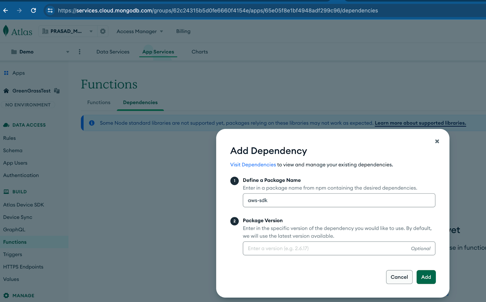
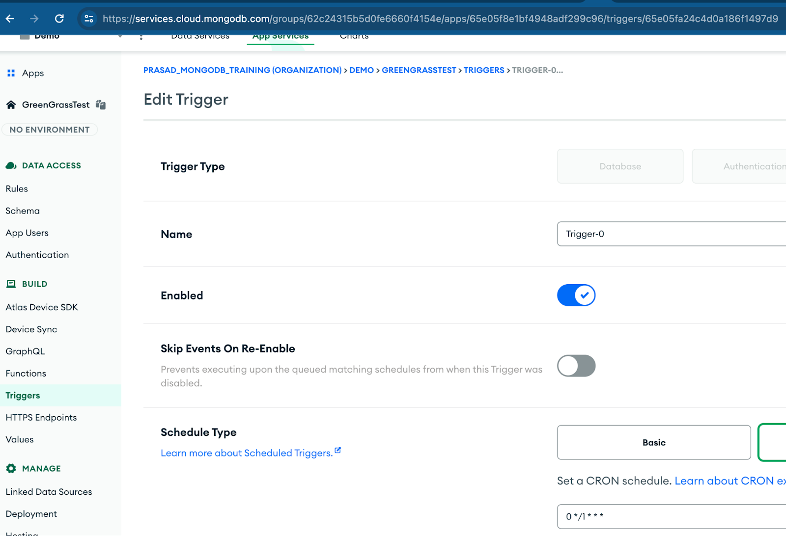

# Set up Atlas Predictive Maintenance backend

## Prerequisites

* S3 bucket to which vehicle sensor data is exported.
  * Credentials (Access and Secret key) to upload to the above S3 bucket.

## 1. Set up the MongoDB Atlas Cluster

1. Create a [MongoDB Cloud](https://cloud.mongodb.com/) user account and ensure that you have access to an organization/project. 
2. Under the Database tab, click "Build A Database" and [create a free MongoDB cluster](https://www.mongodb.com/docs/atlas/tutorial/create-new-cluster/) in your preferred region and name it ```fleet-db```. *You can choose a Free Tier (Shared), or a Dedicated cluster.*

## 2. Set up App Services

1. [Install appservice-cli](https://www.mongodb.com/docs/atlas/app-services/cli/#app-services-cli)
2. [Generate API key](https://www.mongodb.com/docs/atlas/app-services/cli/#generate-an-api-key), assign the ```Project Owner``` permission and add your IP address to the access list
3. [Login with your API key](https://www.mongodb.com/docs/atlas/app-services/realm-cli/v2/#authenticate-with-an-api-key)
   
    `appservices login --api-key="<API-Key>" --private-api-key="<Private-Key>"`
   
5. Change the working directory to `cd 1-atlas/app-services`
6. Import the IoT Greengrass Realm GenAI framework application `appservices push --local ./ --remote GreenGrassTest` and configure the [options](https://www.mongodb.com/docs/atlas/app-services/manage-apps/create/create-with-cli/#run-the-app-creation-command) according to your needs. If you are unsure which options to choose, the default ones are usually a good way to start<br><br>

**sample configuration**


    After you've chosen your options, you should see the following appear: <br><br>

        App created successfully    
        ...    
        Successfully pushed app up: Your App ID 

    Your App ID should be in the following format: YourAppName-XXXXX<br><br>

    **Secret variables are not stored in the config for security reasons and will need to be manually created for the app service functions to work.**<br><br>

6. Define and Access Secrets.<br><br>

   First we [create the secrets](https://www.mongodb.com/docs/atlas/app-services/values-and-secrets/define-and-manage-secrets/#define-a-secret).
   We need to create 2 secrets, `AWSAccessKeyId` & `AWSSecretAccessKey`
   Fill in the values with your AWS credentials.<br><br>

       appservices secrets create
   

   **Screenshot of the appservice secret creation: AWSAccessKeyId**


   


   **Screenshot of the appservice secret creation: AWSSecretAccessKey**
   
   


   These secrets are accessed from the function that uploads telemetry data to the S3 bucket. To do so we must [Link 2 values](https://www.mongodb.com/docs/atlas/app-services/values-and-secrets/define-a-value/#create-a-new-value) `AWSAccessKeyIdRef` & `AWSSecretAccessKeyRef` and link each with the Secrets we created above.<br><br>


   


8. Validate that the MongoDB Atlas cluster database and Application Service features are created successfully.

   Database:

   


   Application Services:

   Functions:

   

   Triggers:

   

   HTTPS Endpoints:

   

   Linked Data Sources:

   


9. Add `aws-sdk` depencency to the functions to allow the function to use aws sdk library which is used for exporting the sensor data to the s3 bucket.

   

9. Create a S3 bucket as "aws-iot-vehicle-telemetry" in the AWS Account.
    


10. Congrats! The first part is done. Now you'll continue with setting up Edge Gateway and Vehicle Simulator ["Part 2: Set up Edge Gateway and Vehicle Simulator"](../2-edge/).


## Debugging

In case if you don't see the triggers workig as expected, check if it is enabled in the triggers section in App Services



