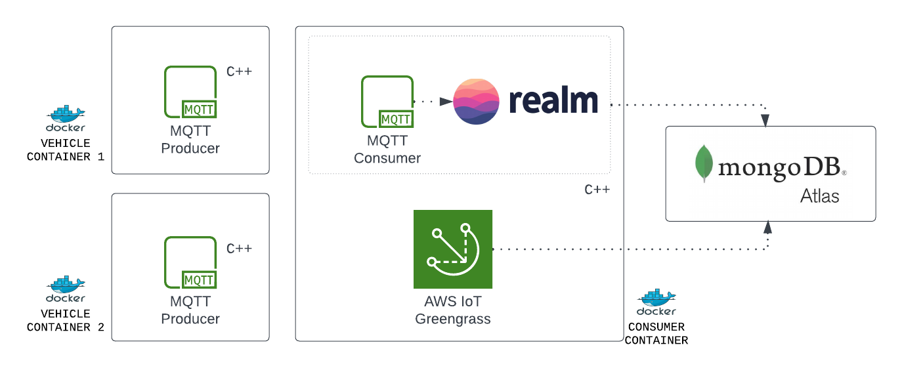

# Realm Device Sync | Greengrass | MQTT

## Prerequisites

* [Docker](https://www.docker.com/products/docker-desktop/)
* MacOS / Ubuntu

## Overview

Here we are building four docker containers

**1. MQTT CONTAINER** [./mosquitto](./mosquitto/) [Optional, if the system already has MQTT installed].
  
**2. CONSUMER CONTAINER** [./greengrass](./greengrass/) acts as an MQTT message consumer and once it receives the data from vehicle sensors it reads and stores them in the realm database which then syncs it back to Atlas via device sync in real-time. This application is built using C++ with Realm dependency, JSON lib dependency, and MQTT dependency.

**3. VEHICLE CONTAINER 1** [./vehicle1](./vehicle1/) acts as a MQTT message producer which sends a message to a topic. This application is also built with C++.

**4. VEHICLE CONTAINER 2** [./vehicle2](./vehicle2/) Same as `VEHICLE CONSUMER 1`[Optional]

You can spin up any number of vehicle containers to simulate multiple vehicles. The only caveat is updating the vehicle ID when sending a message to the producer.cpp before you run it in that container.

