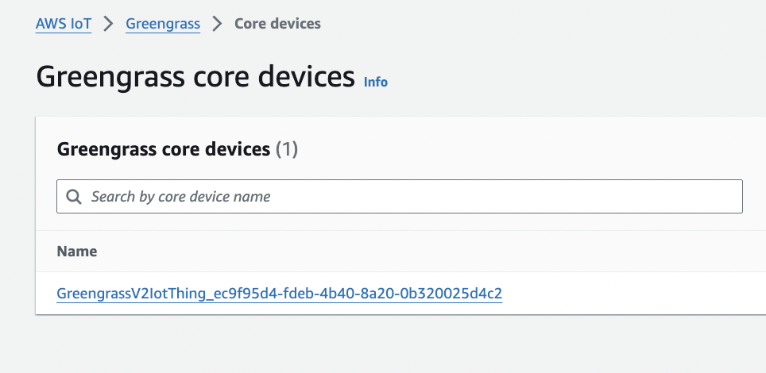

# Realm Device Sync | Greengrass | MQTT
--- 

## Prerequisites

* [Docker](https://www.docker.com/products/docker-desktop/) 
* MacOS / Ubuntu

----

## Overview

Here we are building the docker image and running the container which will have pre-installed dependency libraries for Realm and Greengrass.

The following container will have a C++ application deployed via AWS Component that listens for the messages from a topic name `topic` and will parse and save the message received in it to Realm local database, which then syncs to Atlas via Device sync in real-time.


Refer to this container as `CONSUMER CONTAINER` throughout the setup.

## Preinstall steps

1. Change the directory `2-edge/1-docker/greengrass` and ensure the .env file is updated with the following parameters
   
         GGC_ROOT_PATH=/greengrass/v2
         AWS_REGION=us-east-1
         PROVISION=true
         TES_ROLE_NAME=GreengrassV2TokenExchangeRole
         TES_ROLE_ALIAS_NAME=GreengrassCoreTokenExchangeRoleAlias
         COMPONENT_DEFAULT_USER=ggc_user:ggc_group


3. Duplicate  the "credentials.sample" and update the AWS credentials. i.e aws_access_key_id and aws_secret_access_key
   
   `cp greengrass-v2-credentials/credentials.sample greengrass-v2-credentials/credentials`

### Instructions

After building this image, it will consist of pre-installed libraries for the realm and Greengrass dependencies.

```
docker build -t realmgreengrass .
```

 * **Note**: If you want to provision the device upon startup for cloud deployments, you will need to add the following lines to your docker-compose file to mount your AWS credentials into the container to be picked up at `/root/.aws/credentials`. Ensure that the `:ro` suffix is present at the end of the command to ensure read-only access. (This will build an image using long-term credentials from an IAM user). 
 
```
environment:  
 - PROVISION=true
volumes:  
 - /path/to/credential/directory/:/root/.aws/:ro
```

For more information [Refer here](https://github.com/aws-greengrass/aws-greengrass-docker/blob/main/README.md)


To run the docker container

```
docker-compose -f docker-compose.yml up -d
```

To view running containers

```
docker ps -a
```

Check if the device is created successfully in the AWS IoT Greengrass console.This may take a few minutes



Congratulations!! you have successfully set up the Greengrass container. Now let's move to set up the container for [./vehicle1](../vehicle1/)  
