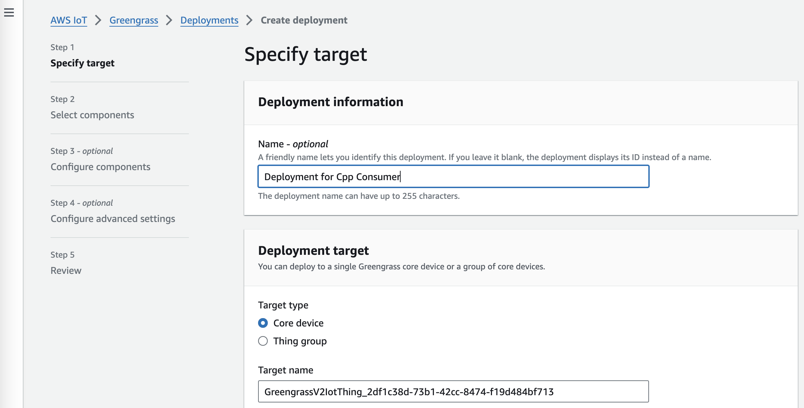

# C++ | MQTT | Consumer

## Prerequisites

* [CMake](https://cmake.org/download/) 
* MacOS / Ubuntu

## Overview

Here we are building the C++ application with MQTT consumer and Realm Device sync to consume the message from the MQTT transport and store it in the Realm database which will be synced to MongoDB in real-time via Device Sync

Change the Realm App Id in `2-edge\2-edge\cpp\consumer\consumer.cpp` file.  **realm::App("REALM_APP_ID");**


Enable API-key authentication and create an API-key in [Mongo App Services](https://www.mongodb.com/docs/atlas/app-services/authentication/api-key/#create-a-server-api-key)
Use this key inside the C++ code in **consumer.cpp** file in **realm::App::credentials::api_key("API_KEY")**


### Instructions

```
cd cpp/consumer

mkdir build

cmake -B build -S . -DCMAKE_BUILD_TYPE="Debug" .

cmake --build build --config Debug
```


(Optional) To run the consumer in the local

```
build/consumer
```

Steps to deploy the C++ Application to the Greengrass device container via [AWS Components](https://docs.aws.amazon.com/greengrass/v2/developerguide/create-components.html)

1. Zip the build folder as `consumer.zip`
2. Upload to AWS S3 Bucket using the console or [aws-cli](https://docs.aws.amazon.com/cli/latest/userguide/getting-started-install.html) using `aws s3 cp consumer.zip s3://{BUCKET_NAME}/cpp.consumer.realm/1.0.0/`
3. Ensure the role "GreengrassV2TokenExchangeRole" has appropriate permissions to read the files from the S3 bucket.
4. Create an AWS Greengrass Component using the console or aws-cli https://docs.aws.amazon.com/greengrass/v2/developerguide/create-components.html


4. Recipe example. Update the S3 bucket path.
```sh
RecipeFormatVersion: "2020-01-25"
ComponentName: "cpp.consumer.realm"
ComponentVersion: "1.0.0"
ComponentType: "aws.greengrass.generic"
ComponentDescription: "Realm C++ Consumer"
Manifests:
- Platform:
    os: "linux"
  Lifecycle:
    install:
      Script: "chmod +x {artifacts:decompressedPath}/consumer/build/consumer"
      RequiresPrivilege: "true"
    Run: "{artifacts:decompressedPath}/consumer/build/consumer"
  Artifacts:
  - Uri: "s3://{BUCKET_NAME}/cpp.consumer.realm/1.0.0/consumer.zip"
    Unarchive: "ZIP"
Lifecycle: {}
```

5. Once the component is created, open the component and deploy it to an Greengrass device using the Deploy option and create new deployment by entering the greengrass core device.

6. Wait for few minutes for the deployment to be completed. Now the producer can produce message to the topic which will be consumed by this application deployed using the components. 
