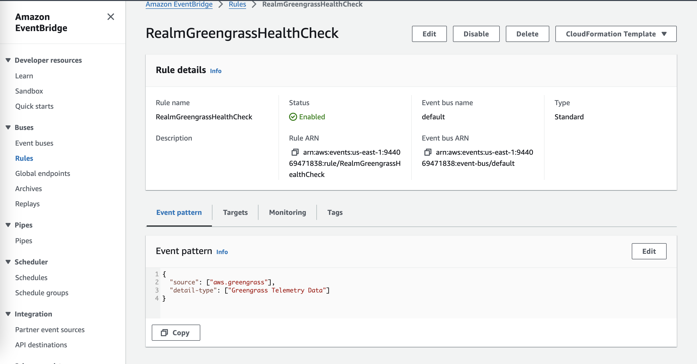
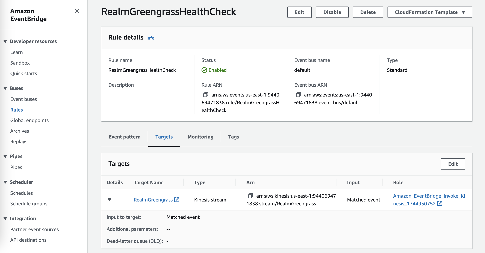
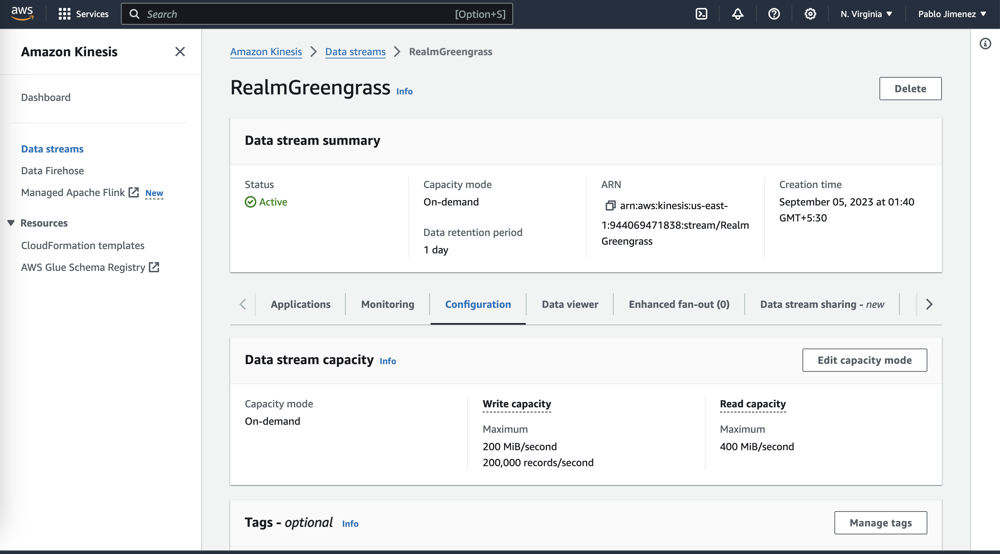
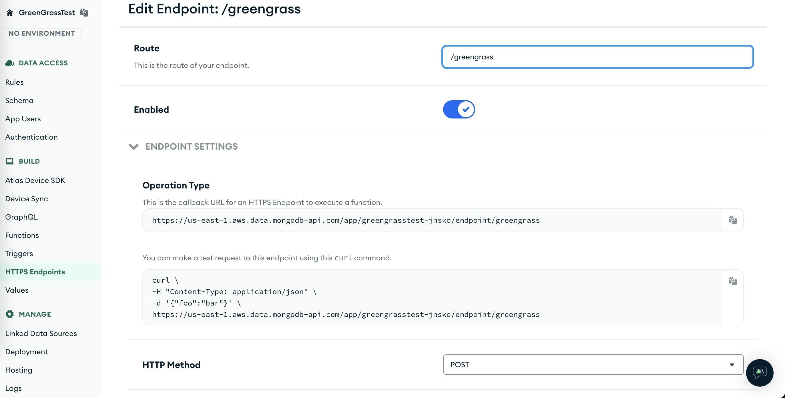
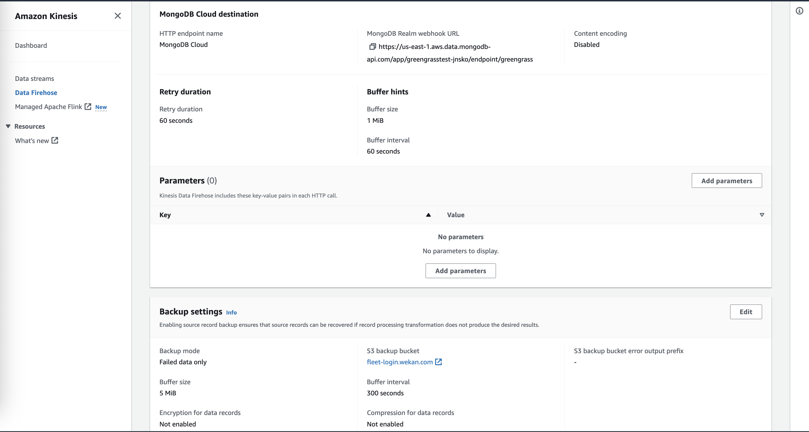

# Device health telemetry

IoT Device health telemetry data helps you monitor the performance of critical operations on your Greengrass core devices. You can use these applications to gain insights into fleet health.

To set it up,

1. Open the Amazon EventBridge console, and choose Create rule.
2. Under Name and description, enter a name and description for the rule.
3. Under Creation method, Select `Use Pattern Form`. <br><br>
4. For Event Source, choose AWS Services, For AWS Service, choose Greengrass, For Event type, select Greengrass Telemetry Data.
5. Under Select event bus, keep the default event bus options.
6. Under Select targets, configure your target. The following example uses an Amazon Kinesis. <br><br>
7. Create on-demand <br>[AWS Kinesis Data Stream ](https://us-east-1.console.aws.amazon.com/kinesis/home?region=us-east-1#/streams/create) 
8. Go to Mongo Cloud, inside App Services, create an HTTP Endpoint with POST method, return type as JSON, and create a function to associate the HTTP endpoint with it and use following sample code to create the telemetry health records in the MongoDB Collection

    ```javascript
    exports = function ({ headers, body }, response) {
        const contentTypes = headers["Content-Type"];
        const reqBody = body;
        const serialized = reqBody.text();
        const jsonBody = JSON.parse(serialized);
        console.log(jsonBody);
        const GGIotDeviceHealthCollection = context.services.get("mongodb-atlas").db("VehicleMaintenance").collection("DeviceHealth");
        GGIotDeviceHealthCollection.insertOne(jsonBody)
            .then(result => console.log(`Successfully inserted item with _id: ${result.insertedId}`))
            .catch(err => console.error(`Failed to insert item: ${err}`))
        response.setStatusCode(200)
        const res = JSON.stringify({
            requestId: headers['X-Amz-Firehose-Request-Id']?.[0],
            timestamp: (new Date()).getTime()
        })
        response.addHeader(
            "Content-Type",
            "application/json"
        );
        response.setBody(res)
        return
    };
    ```
    

9. Create an [API Key in App services](https://www.mongodb.com/docs/atlas/app-services/authentication/api-key/) to use in AWS Firehose for granting access to AWS to trigger the HTTP Endpoint. <br><br>

10. Create [AWS Kinesis Data Firehose](https://us-east-1.console.aws.amazon.com/firehose/home?region=us-east-1#/create). Select source as Kinesis data stream and target as MongoDB Cloud, In Destination settings, Paste the HTTP URL in the Firehose console under MongoDB Realm webhook URL. Then use the API Key created in MongoDB Console, and paste it in API Key in Firehose console. No data transformation needed for this example. And select Not enabled in Content encoding. <br><br>

11. Configure Backup settings to send failed data to S3 buckets. Select the S3 bucket name in dropdown to send failed events, and provide a prefix if needed. Then create the delivery stream.
