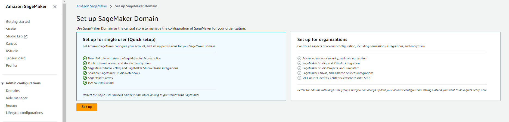
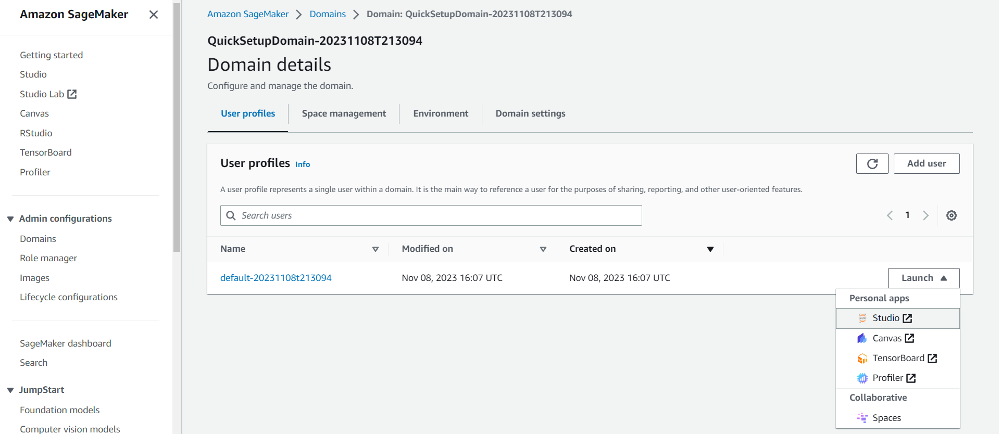
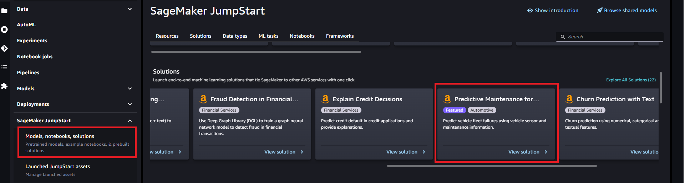
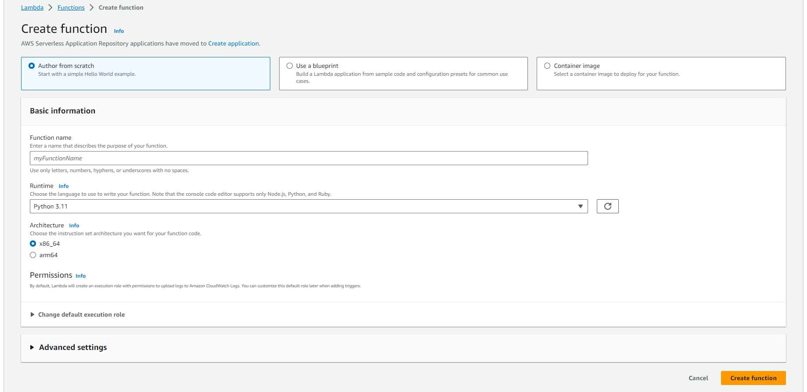
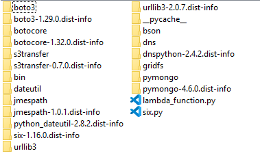
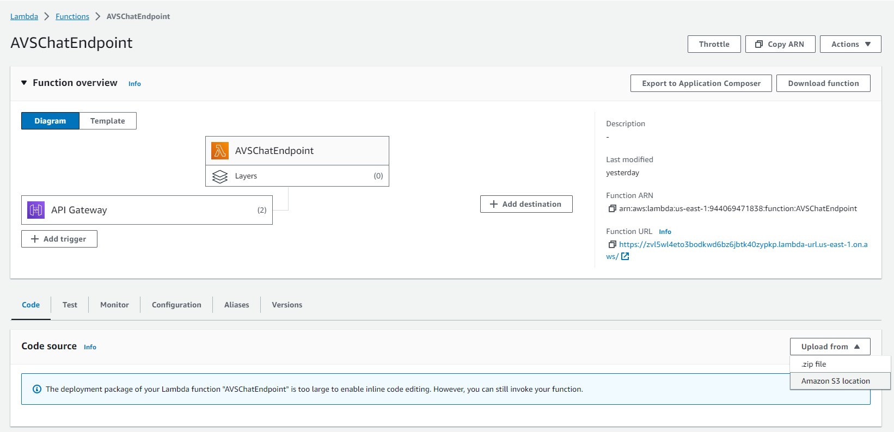
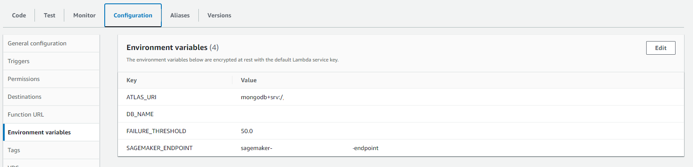
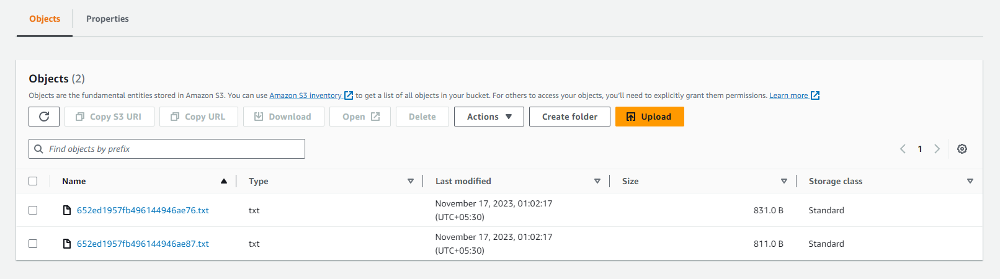
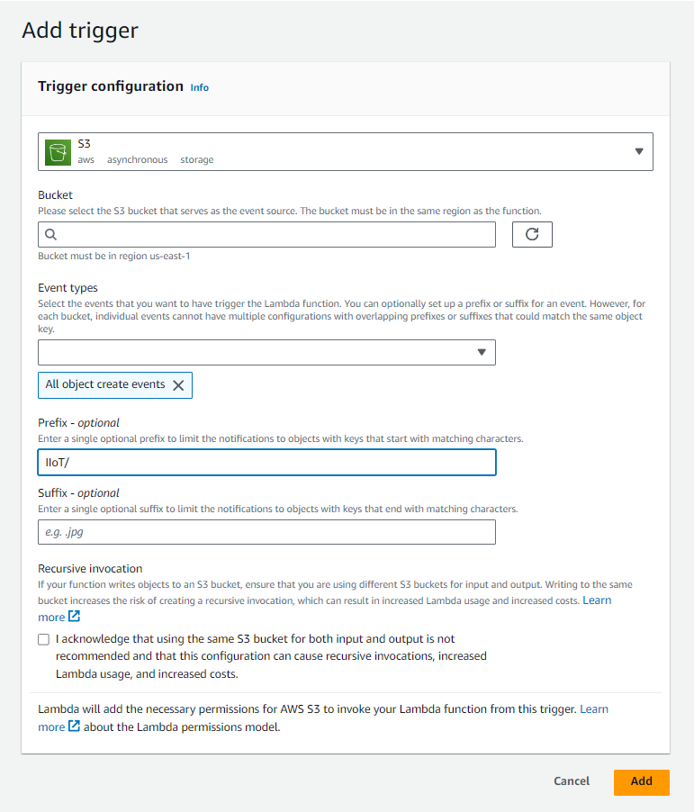

# Set up AWS backend for Predictive Maintenance

We will be using a sagemaker jumpstart solution to quickly deploy a model, train it and create an endpoint.

## 1. Sagemaker

This solution uses the ML model provided by the SageMaker jumpstart <https://github.com/awslabs/aws-fleet-predictive-maintenance/> to do predictive maintenance for the vehicles.

You'll need to access Sagemaker Studio to quickly setup the jumpstart solution. To do that, open up your AWS Console, go to Sagemaker and click on create domain.



Choose Quick setup and click on set up.

This will take some time.

Once the domain is ready. Click on the dropdown and choose Studio as shown below



Then open up Studio classic.

Once it opens up, navigate to JumpStart solutions, choose Predictive maintenance for vehicle fleets, launch it and follow the steps to deploy the model, train it and create an endpoint.



## 2. Setting up Lambda function for Predictive Maintenance

## 2.1 Creating the Lambda function

Log in to AWS Console, got to Lambda functions and click on create function.



Provide a name for your function, be sure to choose Python 3.11 as the Runtime and click on create function.

## 2.2 Deploying to Lambda

Now that our chat Lambda function is created, we'll deploy our code to it.

The chat function needs additional packages, namely **boto3** and **pymongo (v4.6.0)** to interface with the Sagemaker endpoint and Atlas cluster.

On your local machine, install the packges in the same folder you place lambda_function.py in. You can install packages to a specific folder using the below command

```bash
pip install --target ./ package_name
```

Zip up the contents of the entire folder (lambda_function.py and the other package folders). **Make sure the packages and the lambda function code are at the top level as shown below**



Now upload your zip file to an S3 bucket as it'll be too large to directly upload to your Lambda function.

Open up the Lambda function we created earlier, go to code, click on upload from and choose Amazon S3 location as shown below.



Now enter the path to the zip file in your s3 bucket and click on Save.

## 2.3 Setting up environment variables

Open up the Lambda function, go to configuration and configure the below environment variables



Fill in the values with your cluster's connection string and your sagemaker endpoint and save.

## 2.4 Setting up S3 trigger

The final step is to run this function, to do that we'll set up a trigger that runs it when new sensor data is uploaded to a source S3 bucket.

As shown below, the export trigger in App Services uploads data as simple text files into your configured S3 bucket at the configured interval.



Here the file names are the vehicle ids (MongoDB Object IDs) and the files themselves contain the last 20 voltage and current sensor readings in the format expected by the sagemaker endpoint.

To set up the trigger, open your Lambda function and click on Add trigger.



In the Select a source dropdown, choose S3, fill in the prefix (the one used in the export function in app services), check Acknowledge and click on Add.
