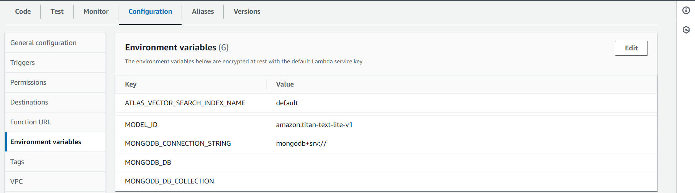

# Amazon Bedrock

This solution uses two models provided by Bedrock, the Titan Embeddings G1 to generate embeddings and Titan Text G1 - Lite to answer questions.

## 1. Model Access

Before you can use the LLMs provided by Bedrock, you'll need to request for access to them. 


To request access to the required two titan models, open up Model Access from the side menu.


Then click on Manage model access. This will let you choose the models you want and request for access.


Now choose the the Titan Embeddings G1 and Titan Text G1 - Lite models and click on Save changes.


Request to most models should be granted fairly quickly.

## 2. Import sample data for Vehicle Knowledge Base

Import the [sample vehicle kb data](./1-generate-embeddings/data/vehicle_knowledge_base_sample.json) into a collection on your MongoDB cluster.

We use the entire document to generate embeddings, if you have your data you can simply import it into the collection instead.

## 3. Generate Embeddings

We need to install a few packages before we can generate the embeddings.

Create an environment to run [generate_embeddings.py](./1-generate-embeddings/generate_embeddings.py)

Then install the packages

```bash
pip install langchain langchain_community pymongo boto3
```

Before we can run it, we'll need to set up a few environment variables

We use Amazon's amazon.titan-embed-text-v1 model to generate embeddings, so set EMBEDDING_MODEL_ID to amazon.titan-embed-text-v1

The following, set with your AWS and MongoDB cluster information

AWS_SERVER_PUBLIC_KEY

AWS_SERVER_SECRET_KEY

MONGODB_CONNECTION_STRING

MONGODB_DB // Database name

MONGODB_DB_KB_COLLECTION // Collection in the above DB in which the vehicle kb data is stored.

MONGODB_DB_EMBEDDING_COLLECTION // Collection in the above DB in which embeddings are stored.

ATLAS_VECTOR_SEARCH_INDEX_NAME

Finally run [generate_embeddings.py](./1-generate-embeddings/generate_embeddings.py) to generate embeddings.

## 4. Set up the index in Atlas Vector Search

Open up Atlas, go to your project and Atlas Search, and create an index on your cluster following the steps at [Create an Atlas Vector Search Index](https://www.mongodb.com/docs/atlas/atlas-vector-search/create-index/#create-an-atlas-vector-search-index)

Use the following for the index definition and save it.

```json
{
  "mappings": {
    "dynamic": true,
    "fields": {
      "embedding": {
        "dimensions": 1536,
        "similarity": "cosine",
        "type": "knnVector"
      }
    }
  }
}
```

You should now have an index setup as shown below


## 5. Set up AWS Lambda function to provide an endpoint for Field Technician's Mobile Application

Log in to AWS Console, go to Lambda functions, and click on create function.


Provide a name for your function, be sure to choose Python 3.11 as the Runtime and click on create function.

### 5.1 Deploying to Lambda

Now that our chat Lambda function is created, we'll deploy our code to it.

On your local machine, install the packges in the same folder you place lambda_function.py in. You can install packages to a specific folder using the below command

```bash
pip install --target ./ package_name
```

Zip up the contents of the entire folder (lambda_function.py and the other package folders). **Make sure the packages and the lambda function code are at the top level as shown below**


Now upload your zip file to an S3 bucket as it'll be too large to directly upload to your Lambda function.

Open up the Lambda function we created earlier, go to code, click on upload from and choose Amazon S3 location as shown below.


Now enter the path to the zip file in your s3 bucket and click on Save.

### 5.2 Setting up environment variables

Open up the Lambda function, go to configuration and configure the below environment variables



Fill in the values with your cluster's connection string, db name, collection name and save.
