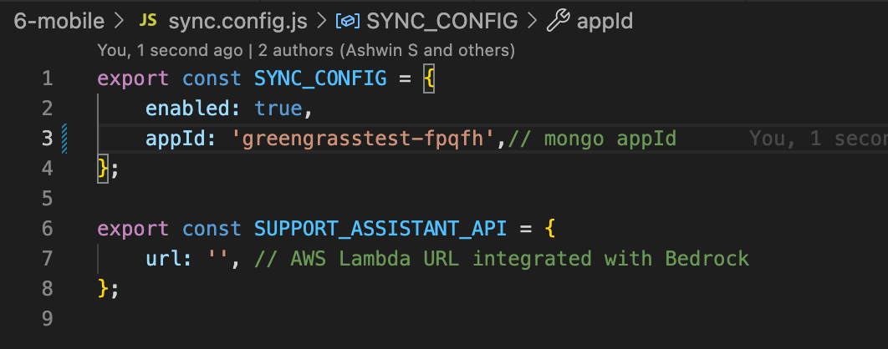

# Fleet mobile app

This React Native application enables users to manage their assigned jobs. The app is powered by Realm Device Sync https://www.mongodb.com/docs/realm/sdk/react-native/sync-data/configure-a-synced-realm/] for real-time synchronization of jobs.


This project is bootstrapped using [`@react-native-community/cli`](https://github.com/react-native-community/cli).

## Getting Started

> **Note**: Make sure you have completed the [React Native - Environment Setup](https://reactnative.dev/docs/environment-setup) instructions till "Creating a new application" step, before proceeding.


## Configuration

Update the App Services Application ID and AWS Lambda http url for the chat assistant inside the `sync.config.js` 

   

### Node Modules install

```sh
# using yarn
yarn install
```


### Pod install 

```sh
cd ios && pod install && cd ..
```


### Step 1: Start the Metro Server


First, you will need to start **Metro**, the JavaScript _bundler_ that ships _with_ React Native.

To start Metro, run the following command from the _root_ of your React Native project:

```sh
# using npm
npm start


# OR using Yarn
yarn start
```

### Step 2: Start your Application

Let Metro Bundler run in its _own_ terminal. Open a _new_ terminal from the _root_ of your React Native project. Run the following command to start your _Android_ or _iOS_ app:

### For Android

```bash
# using npm
npx react-native run-android
```

### For iOS

```bash
# using npm
 npx react-native run-ios
```

If everything is set up _correctly_, you should see your new app running in your _Android Emulator_ or _iOS Simulator_ shortly provided you have set up your emulator/simulator correctly.

### Creating User

Register from the app, and then use the same information to log in later. it will create a entry in User collection.
use '\_id' field to map Jobs with the user.

### Config

Use sync.config.js to setup **AppID** and **AWS Lambda HTTP Url**.

### Environment Configurations

```sh
  - System:
    OS: macOS 14.0
  - Binaries:
    Node: 19.1.0 - ~/.nvm/versions/node/v19.1.0/bin/node
    Yarn: 1.22.19 - /usr/local/bin/yarn
    npm: 8.19.3 - ~/.nvm/versions/node/v19.1.0/bin/npm
  - Managers:
    CocoaPods: 1.14.2 - /usr/local/bin/pod
  - IDEs:
    Android Studio: 2022.3 AI-223.8836.35.2231.10811636
    Xcode: 15.0.1/15A507 - /usr/bin/xcodebuild
  - Languages:
    Java: 11.0.20.1 - /usr/bin/javac
  - npmPackages:
    react: 18.2.0 => 18.2.0
    react-native: 0.72.6 => 0.72.6
```

## Features

### Job List

- The user has the ability to view assigned Jobs categorized according to their status.
- Job listings show vehicle details, service types, and notes.
- The user can change the job status to "in progress," "canceled," or "completed" and can also add notes if needed

### Help

- The users can seek assistance from experts through the help section via chat, addressing queries related to parts availability and more.
- The chat conversations are saved locally and can be utilized for future references. 
