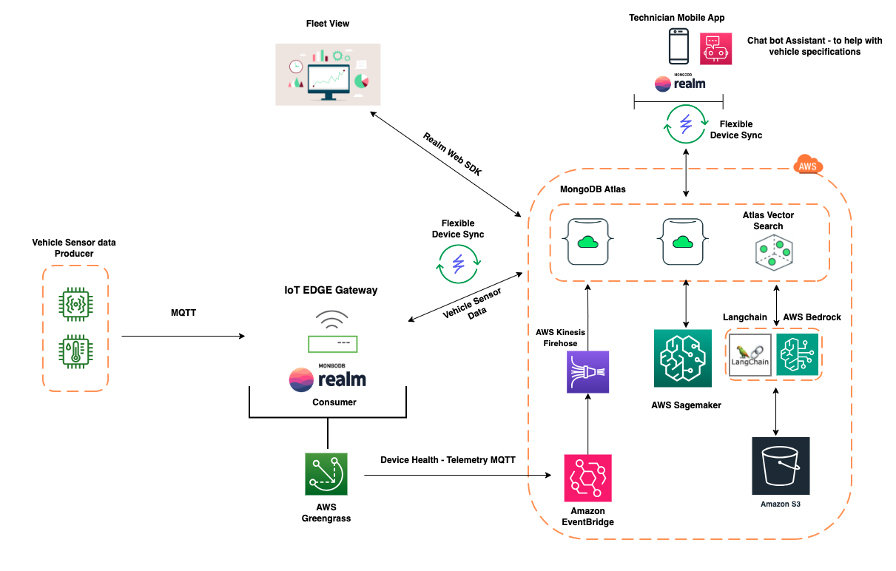

# AWS IoT Greengrass | Realm | Atlas | Sagemaker | S3 | Llama | Gen AI

## High level Architecture

## Repo structure

### AWS

[aws](./aws/) holds code and docs on setting up sagemaker and the lambda functions needed for predictive maintenance and the chatbot.

### Atlas App Services

[atlas](./atlas/) holds the configuration of the app service application that needs to be set up on Atlas for the mobile app.

### Edge

[docker](./docker/) holds the docker files needed to create and run the various containers needed for the edge. 

The greengrass container also creates the necessary things, thing types, and devices on greengrass on AWS.

[edge](./edge/) holds the code for the consumer and producer.

Consumer is the component running on greengrass that interfaces with Realm to store sensor data.

Producer is are the vehicles sending sensor data. In our case, voltage and current readings.

### Web

[web](./web/) holds the code for the web dashboard. This shows information about the fleet.

### Mobile

[mobile](./mobile/) holds the mobile app code that shows maintenance jobs created for vehicles after analyzing their sensor data.
