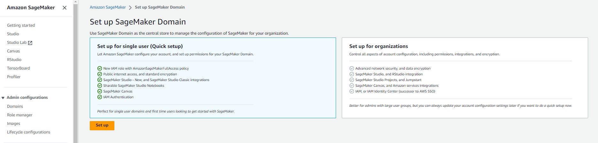
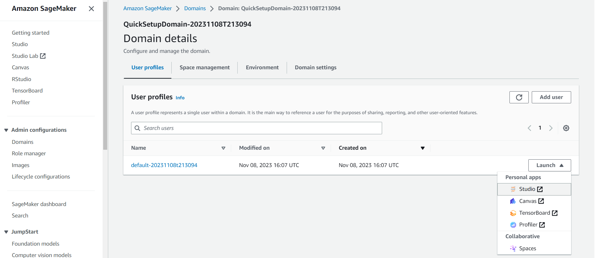

# AWS

## Table of Contents

- [AWS](#aws)
  - [Table of Contents](#table-of-contents)
  - [Greengass](#greengass)
  - [Predictive Maintenance](#predictive-maintenance)
    - [Sagemaker](#sagemaker)
    - [Lambda](#lambda)
  - [Chatbot](#chatbot)
    - [Lambda](#lambda-1)

## Greengass 

Greengrass is configured on your AWS automatically when you build and run the [greengrass docker container](../docker/greengrass/)

You can details about using *AWS EventBridge*, *Kinesis Data Stream* and *Kinesis Data Firehose* to export device health metrics to a MongoDB collection on Atlas [here](./telemetry/)

## Predictive Maintenance

We will be using a sagemaker jumpstart solution to quickly deploy a model, train it and create an endpoint.

### Sagemaker

This solution uses the ML model provided by the SageMaker jumpstart <https://github.com/awslabs/aws-fleet-predictive-maintenance/> to do predictive maintenance for the vehicles.

You'll need to access Sagemaker Studio to quickly setup the jumpstart solution. To do that, open up your AWS Console, go to Sagemaker and click on create domain.

Choose Quick setup and click on set up.

This will take some time.

Once the domain is ready. Click on the dropdown and choose Studio as shown below

Once Studio open up, navigate to JumpStart solutions, choose Predictive maintenance for vehicle fleets, launch it and follow the steps to deploy the model, train it and create an endpoint.

### Lambda

[predict](./lambda/predict/) holds the code for the predictive maintenance Lambda function and details on how to set it up.

This function invokes the Sagemaker endpoint when new data is pushed to the source S3 bucket and creates maintenance jobs in the Atlas MongoDB cluster based on the predictions. These jobs can be seen on the mobile app.

## Chatbot

### Lambda

[chat](./lambda/chat/) holds the code for the chat endpoint Lambda function and details on how to set it up.

This function invokes the Sagemaker endpoint when new data is pushed to the source S3 bucket.