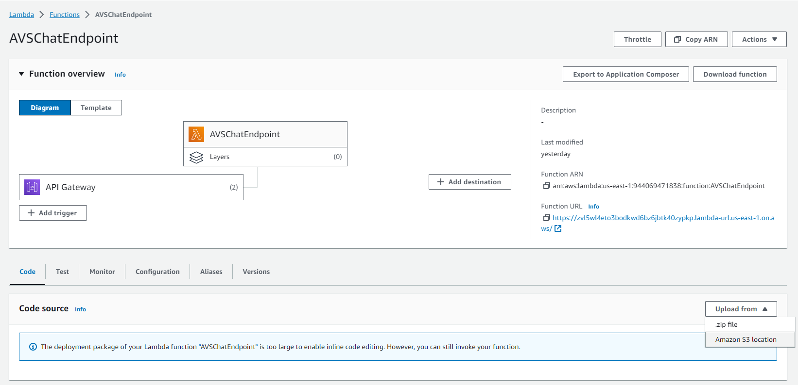

# Setting up OpenAI chat endpoint in Lambda

## Prerequisites

* S3 bucket to deploy code to Lambda
* Cluster on Atlas

## Creating the Lambda function

Log in to AWS Console, got to Lambda functions and click on create function.


Provide a name for your function, be sure to choose Python 3.11 as the Runtime and click on create function.

## Deploying to Lambda

Now that our chat Lambda function is created, we'll deploy our code to it.

The chat function needs additional packages, namely **llama-index (v0.8.56)** and **pymongo (v4.6.0)** to interface with OpenAI and the Atlas cluster.

On your local machine, install the packges in the same folder you place lambda_function.py in. You can install packages to a specific folder using the below command

```bash
pip install --target ./ package_name
```

Zip up the contents of the entire folder (lambda_function.py and the other package folders). **Make sure the packages and the lambda function code are at the top level as shown below**


Now upload your zip file to an S3 bucket as it'll be too large to directly upload to your Lambda function.

Open up the Lambda function we created earlier, go to code, click on upload from and choose Amazon S3 location as shown below.



Now enter the path to the zip file in your s3 bucket and click on Save.

## Setting up environment variables

Open up the Lambda function, go to configuration and configure the below environment variables


Fill in the values with your cluster's connection string and your OpenAI API key and save.
